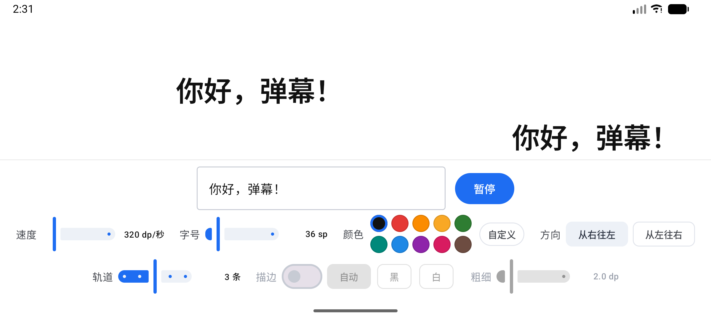
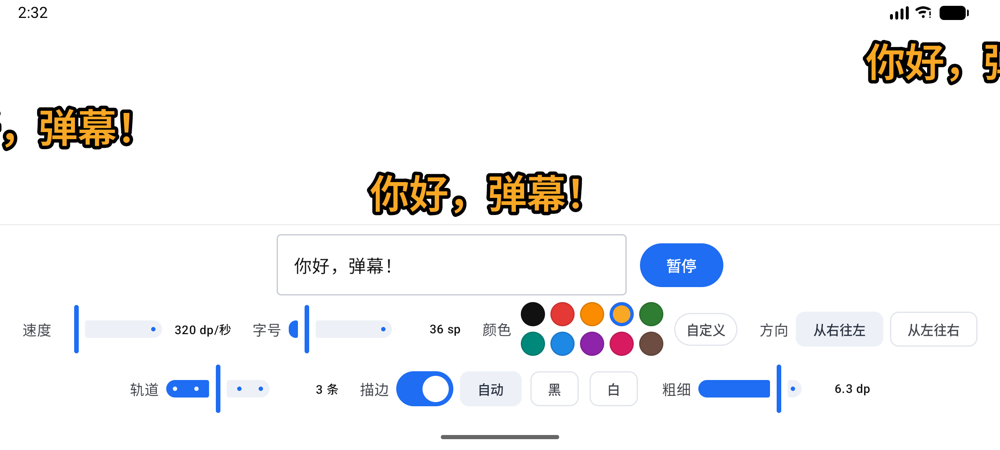
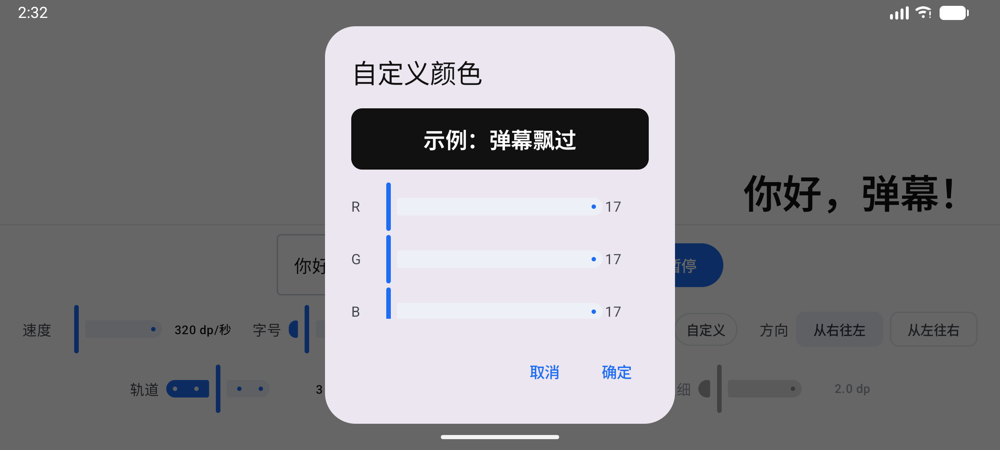
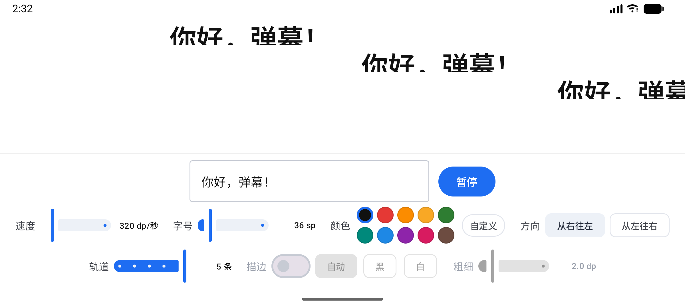
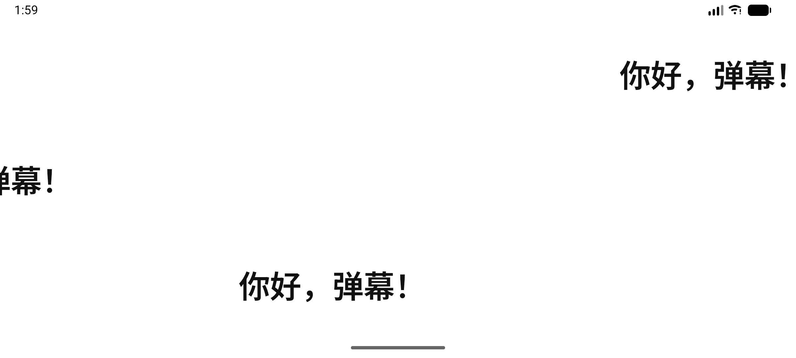
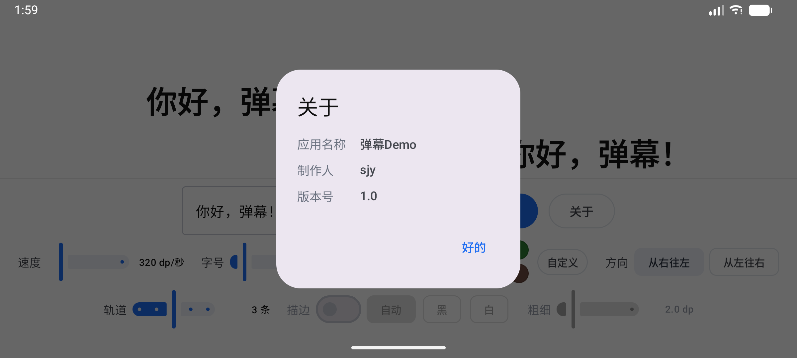

# 弹幕Demo（DanmakuApp）

> 一个横屏、纯白底的 Jetpack Compose 小 App：在输入框里打字，调好速度 / 字号 / 颜色 / 方向 / 轨道 / 描边，文字就会像 B 站横屏弹幕一样一遍遍从屏幕一侧飘到另一侧。



## 功能

- **无限循环滚动**：文字从屏幕外飞入、飞到另一侧屏幕外，停 0.5 秒再来一轮，永不停止
- **方向可切**：从右往左（B 站标准横屏弹幕方向）/ 从左往右
- **实时调节**：速度 60~1600 dp/秒、字号 14~140 sp、10 个预设色 + R/G/B 自定义调色
  （拖动速度滑杆不会打断当前这一轮，下一轮生效）
- **多轨道**：1~5 条弹幕同时飘，按轨道号错峰出发，互不重叠
- **文字描边**：开关 + 描边色（自动 / 黑 / 白）+ 粗细 0.5~8 dp，出来的就是 B 站那种厚边字
- **点空白处收起控制面板**：舞台立刻占满整屏，弹幕改成按整屏高度居中分布，再点一下面板回来
- 暂停 / 播放、关于（制作人 + 版本号）

## 技术信息

| | |
| --- | --- |
| 语言 / UI | Kotlin + Jetpack Compose（Material 3） |
| 构建 | Gradle 9.6 + AGP 9.4.1（用 AGP 内置的 Kotlin 编译） |
| SDK | compileSdk 37 / targetSdk 37 / **minSdk 26**（Android 8.0） |
| 依赖 | 只有 AndroidX + Compose，**没有任何第三方库** |
| 包名 / 应用名 | `com.example.danmaku` / 弹幕Demo |
| 实测环境 | Android Studio 自带模拟器 `Medium_Phone_API_37.0`（2400×1080 横屏） |

## 截图

| 主界面（3 轨道，默认） | 文字描边（黄字黑边） |
| --- | --- |
|  |  |
| **自定义颜色** | **5 条轨道** |
|  |  |
| **点空白处收起面板（弹幕铺满整屏并居中）** | **关于** |
|  |  |

（六张截图都是在 `Medium_Phone_API_37.0` 模拟器上跑出来的真实画面，2400×1080。）

## 用 Android Studio 打开

1. Android Studio → **Open** → 选中 `DanmakuApp` 文件夹（不是里面的 app 文件夹）。
2. 首次同步会下载 AGP / Compose 依赖，等 Gradle Sync 完成。
3. 选一台 API 26+ 的设备（真机或新建模拟器），点绿色 ▶ 运行。

> 本机的 Gradle 官方分发站（services.gradle.org）连不上，所以 `gradle/wrapper/gradle-wrapper.properties`
> 里的 `distributionUrl` 指向了华为云镜像 `https://mirrors.huaweicloud.com/gradle/gradle-9.6.0-bin.zip`。
> 想换回官方源，把这一行改回 `https://services.gradle.org/distributions/gradle-9.6.0-bin.zip` 即可。

> 想在终端里敲 `./gradlew` 的话，需要先给个 JDK：
> `set JAVA_HOME=C:\Program Files\Android\Android Studio\jbr`（Android Studio 自带的就是这个）。

> **注意 AGP 9 的「内置 Kotlin」**：`app/build.gradle.kts` 里**故意没有** `org.jetbrains.kotlin.android` 插件。
> 从 AGP 9.0 起 `com.android.application` 自己就带 Kotlin 编译，再挂 KGP 的 android 插件会直接报错：
> `The 'org.jetbrains.kotlin.android' plugin is no longer required for Kotlin support since AGP 9.0`。
> 所以 `kotlin { compilerOptions { ... } }` 是写在 `android { }` **里面**的，不是外面；
> 而 Compose 编译器插件（`org.jetbrains.kotlin.plugin.compose`）仍然要单独 apply。

## 命令行构建 & 跑一遍模拟器

这个工程已经在本机的 `Medium_Phone_API_37.0` 模拟器上装过、跑通并截了图（就是上面那几张）。

```powershell
# 1) 构建（PATH 上没有 java，必须显式给 JAVA_HOME）
$env:JAVA_HOME = "C:\Program Files\Android\Android Studio\jbr"
cd C:\Users\64561\Documents\DanmakuApp
.\gradlew.bat :app:assembleDebug
# 产物：app\build\outputs\apk\debug\app-debug.apk

# 2) 起模拟器。AVD 名字是 Medium_Phone_API_37.0；
#    命令行启动必须显式给 ANDROID_AVD_HOME，否则 emulator 找不到这台 AVD。
$env:ANDROID_AVD_HOME = "$env:USERPROFILE\.android\avd"
& "$env:LOCALAPPDATA\Android\Sdk\emulator\emulator.exe" -avd Medium_Phone_API_37.0 -gpu swiftshader_indirect

# 3) 转横屏 → 安装 → 启动 → 截图
$adb = "$env:LOCALAPPDATA\Android\Sdk\platform-tools\adb.exe"
& $adb shell settings put system accelerometer_rotation 0
& $adb shell settings put system user_rotation 1
& $adb install -r app\build\outputs\apk\debug\app-debug.apk
& $adb shell am start -n com.example.danmaku/.MainActivity
& $adb shell screencap -p /sdcard/s.png; & $adb pull /sdcard/s.png .
```

## 界面结构

```
┌──────────────────────────────────────────────────┐
│                                                  │
│    弹幕舞台（纯白）   轨道1  ──────────→           │  ← 占满剩余高度
│                       轨道2      ──────────→      │     1~5 条轨道平分高度
│                       轨道3           ──────────→ │
├──────────────────────────────────────────────────┤
│          [ 输入弹幕文字… ]     [ 暂停 / 播放 ]      │  ← 控制区（3 行，整体居中）
│   速度 ▬▬▬  字号 ▬▬▬  颜色 ●●●●●  方向 [ ][ ]      │
│   轨道 ▬▬▬  描边 [ ]  自动·黑·白  粗细 ▬▬▬          │
└──────────────────────────────────────────────────┘
```

- 上面是舞台：文字从屏幕外飞入、飞到另一侧屏幕外，然后停 0.5 秒再来一轮，无限循环。
- 下面控制区横向居中排布；某一行放不下时那一行自动变成横向滚动，不会挤爆布局。
- 点舞台（白色区域）任意空白处就能把控制面板收起来，舞台立刻占满整屏、弹幕改成按整屏高度居中分布；再点一下面板就回来。
- 因为文字要独占一整条跑道，所以控制条没有浮在舞台上面（浮上去会挡住字）。

## 交互说明

| 控件 | 说明 |
| --- | --- |
| 输入框 | 边打字边生效，正在飘的文字会立刻换成新内容并重新起跑 |
| 速度 | 60 ~ 1600 dp/秒，**拖动时不会打断当前这一轮**，下一轮按新速度走 |
| 字号 | 14 ~ 140 sp |
| 颜色 | 10 个预设色（5×2 排布，省横向空间）+ 「自定义」按钮（R/G/B 三根滑杆，带实时预览） |
| 方向 | 「从右往左」= B 站标准横屏弹幕方向；「从左往右」= 反过来 |
| **轨道** | 1 ~ 5 条，平分舞台高度。每条轨道**第一次出发的时间按轨道号错开**（第 N 条晚 `(一轮时长+间隔)×N/轨道数` 出发），所以一进来就能看到好几条在不同位置，之后各自独立循环 |
| **描边** | 开关。关掉时后面的「自动 / 黑 / 白」和「粗细」会置灰不可点 |
| **描边颜色** | `自动` = 浅色字配黑边、深色字配白边；也可以手动锁死黑或白 |
| **描边粗细** | 0.5 ~ 8 dp，默认 2 dp。想要最像 B 站那种厚边，调到 6 dp 左右 |
| 播放 / 暂停 | 暂停时所有轨道停在原地，再点播放会从头再飞一遍 |
| **点空白处** | 点舞台任意位置 = 收起 / 展开控制面板。收起时舞台占满整屏，文字按整屏高度居中分布（1 条轨道时正好在正中央，多条时以屏幕中线对称）。顺手会清掉输入框焦点，软键盘一起收起来 |
| **关于** | 弹出「关于」：应用名称 / 制作人 `sjy` / 版本号 |

> 「自动」描边色**不是**用 `Color.luminance()`（WCAG 相对亮度）算的：橙色 `#F9A825` 的 WCAG 亮度只有 0.48，
> 会被误判成深色，于是给浅色字配上白边 —— 白底上等于没描边。这里改用 YIQ 感知亮度
> `0.299R + 0.587G + 0.114B > 0.6`（橙黄 ≈ 0.70），跟人眼判断一致。见 `DanmakuScreen.kt` 的 `Color.isLight()`。

## 代码结构

| 文件 | 作用 |
| --- | --- |
| `app/src/main/java/com/example/danmaku/MainActivity.kt` | 唯一的 Activity，开边到边显示、常亮屏幕 |
| `app/src/main/java/com/example/danmaku/DanmakuStage.kt` | **核心动画**：量文字宽度 → 算起终点 → 匀速动画 → 循环。1~5 条轨道各一个 `Animatable`；描边靠「两层 `Text` 完全重合」实现 |
| `app/src/main/java/com/example/danmaku/DanmakuScreen.kt` | 主界面 + 三行控制面板 + 自定义颜色弹窗 + 关于弹窗 + `Color.isLight()` |
| `app/src/main/java/com/example/danmaku/ui/theme/Theme.kt` | 只保留浅色配色，背景锁定纯白 |
| `app/src/main/AndroidManifest.xml` | `screenOrientation="landscape"` 锁横屏 |

### 动画是怎么算的

```kotlin
val startX = if (leftToRight) -textWidthPx.toFloat() else stageWidthPx.toFloat()
val endX   = if (leftToRight) stageWidthPx.toFloat() else -textWidthPx.toFloat()
val durationMs = (distancePx / speedPxPerSec * 1000f).roundToInt()   // 路程 ÷ 速度
offsetX.animateTo(endX, tween(durationMs, easing = LinearEasing))    // 匀速
```

文字宽度用 `rememberTextMeasurer()` 预先量出来（单位像素），所以起终点能精确落在屏幕外沿，
不会出现「字还没完全进来就开始算」或者「飞到一半就消失」的问题。

多轨道就是把这套东西放进 `Column` 的 `weight(1f)` 里跑 N 份，外加一次性的错峰：

```kotlin
// 只在第一次错开；之后每条轨道的周期都一样，所以不会越跑越乱
if (trackCount > 1) delay((durationMsNow() + gapMillis) * trackIndex / trackCount)
```

速度仍然通过 `rememberUpdatedState` 以 `State<Float>` 传进协程里实时读，所以拖速度滑杆不会打断当前这一轮。

### 描边是怎么画的

```kotlin
Box(Modifier.offset { IntOffset(offsetX.value.roundToInt(), 0) }) {
    if (strokeEnabled) {
        Text(text, style = TextStyle(..., drawStyle = Stroke(strokeWidthPx, join = StrokeJoin.Round)),
             color = strokeColor)          // 第一层：只有轮廓的「空心字」
    }
    Text(text, style = TextStyle(...), color = color)   // 第二层：实心字盖上去，两层像素级重合
}
```

描边是往字形轮廓**外面**再扩 `strokeWidthPx / 2`，所以视觉上字会稍微胖一圈，
轨道高度就是按字号 + 描边留的余量。

### 点空白处收面板 & 「关于」

面板是收在 `Column` 里、靠 `weight(1f)` 抢剩余高度的，所以面板一收，舞台自动从「上半屏」变成「整屏」，
轨道跟着按整屏高度重新平分 —— 1 条轨道时文字正好落在屏幕正中央：

```kotlin
DanmakuStage(
    ...,
    modifier = Modifier
        .weight(1f)
        .pointerInput(Unit) {
            detectTapGestures {              // 整个舞台都是「点一下收 / 展面板」的热区
                focusManager.clearFocus()    // 顺手收起软键盘
                settingsVisible = !settingsVisible
            }
        }
)

AnimatedVisibility(settingsVisible, enter = expandVertically(), exit = shrinkVertically()) {
    ControlPanel(...)
}
```

「关于」里的版本号是**运行时读的**，不是写死的字符串，改 `app/build.gradle.kts` 的 `versionName` 就跟着变：

```kotlin
val pm = context.packageManager
val info = if (Build.VERSION.SDK_INT >= Build.VERSION_CODES.TIRAMISU) {
    pm.getPackageInfo(context.packageName, PackageManager.PackageInfoFlags.of(0L))  // API 33+ 的新重载
} else {
    @Suppress("DEPRECATION")
    pm.getPackageInfo(context.packageName, 0)                                        // 老设备走这个
}
info.versionName            // 当前是 1.0
```

## 想改哪里

- **飘完的间隔**：`DanmakuStage(..., gapMillis = 500L)`，调小更连续。
- **每条轨道不一样的颜色/字号**：把 `trackCount: Int` 换成 `List<TrackStyle>`，让 `DanmakuTrack` 按 `trackIndex` 取自己那套样式。
- **把上面这些设置存下来**：加 `androidx.datastore:datastore-preferences`，或用 `rememberSaveable` 把这些状态包起来。
- **飞行时长改成固定值**：`durationMs` 直接给常量，速度滑杆就变成「每屏耗时」。

## 已知限制

- `screenOrientation="landscape"` 在 Android 16+ 的大屏设备（平板/折叠屏展开）上系统会忽略，界面本身是响应式的，横过来一样能用。
- 轨道数拉到 5 条、字号又调得很大时，各行的字会互相压到隔壁轨道上（这是故意不裁剪的，真弹幕也是这么叠的），最外圈描边还可能被舞台上下边缘裁掉一点点。想要每行干净，让「轨道数 × 字号」别超过舞台高度。
- 「自动」描边在**深色字**上会配白边，白底上等于看不出效果 —— 想要描边就选浅色字，或把描边色手动设成黑。
- 控制面板收起后没有常驻的「显示面板」按钮，靠再点一次空白处唤回；整个舞台都是单击热区，以后要往舞台上加拖动 / 长按之类的手势时注意别跟它冲突。
- 没有做设置持久化（`rememberSaveable` 只保证转屏/进程重建时不丢，杀掉进程就回到默认值）。

## 许可证

[MIT](LICENSE) © 2026 sjy
